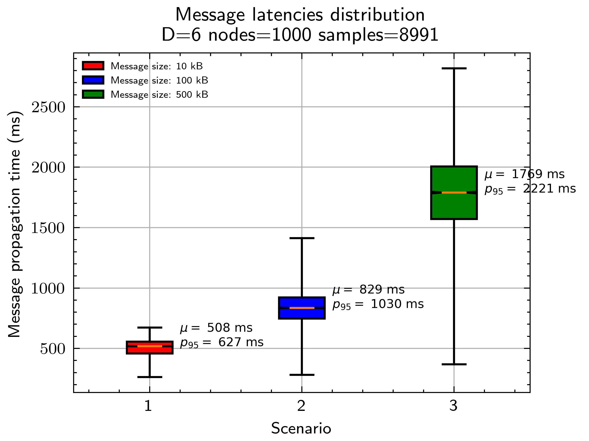

**TLDR**: We present the results of 1000 `nwaku` nodes running `rln` using different message sizes, in a real network with bandwidth limitations and network delays. The goal is to study the message propagation delay distribution, and how it's affected by i) rln and ii) message size in a real environment. We observe that for messages of `10kB` the average end-to-end propagation delay is `508 ms`. We can also observe that the message propagation delays are severely affected when increasing the message size, which indicates that it is not a good idea to use waku for messages of eg. `500kB`. See simulation parameters.

## Introduction

Waku uses [relay](https://rfc.vac.dev/spec/11/) as a routing protocol, which is an adaptation of [gossipsub](https://arxiv.org/pdf/2007.02754.pdf). It routes messages following a publisher/subscriber architecture, where nodes can publish messages or subscribe to topics. If message `m` is published to topic `t`, all `i` nodes `n_1...n_i` subscribed to `t` will get `m`. The `relay` protocol ensures that every node gets the messages of the topics it is subscribed to.

However, since `relay` works in a decentralized manner, all nodes contribute to the gossiping of a message, until it has successfully reached all the interested nodes (subscribed to it). This means that a message can travel multiple hops until it reaches all nodes. The amount of hops determines the **message propagation time**, which is measured as the **time difference of when the node published the message and when another node received**.

**This issue aims to go from theory to practice, by i) understanding message propagation times in theory and ii) presenting nwaku simulation results in an end-to-end setup with rln, with real message propagation times**.

## Theory

Let's start with **message propagation times in theory**. On a high level, it depends on:
- The gossipsub [configuration](https://github.com/libp2p/specs/blob/master/pubsub/gossipsub/gossipsub-v1.0.md#parameters), being `D` one of the most important parameters. This sets the hops that a message will travel to reach all nodes. Higher `D`, less hops, less delay. Note that a higher `D` implies more bandwidth consumption.
- The node. Different nodes will see different propagation times, because a message can travel different paths. A node connected directly to the publisher (1 hop) will see lower propagation times than other nodes further away.
- Individual propagation times. Since a message can travel multiple hops to reach its destination, each hop adds a contribution to the overall message propagation time. This individual propagation time depends on the characteristics on the nodes involved in the connections.

In a D-regular graph, like the one formed by waku nodes around a topic, the maximum amount of hops that a message can travel to reach all nodes can be calculated as `ceil(log(total_nodes)/log(D))`. For example, with log(1000)/log(6) = 3.85 = 4. So in a network with 1000 nodes and `D=6`, no matter which node publishes the message, in 4 hops it will reach all the nodes.

Notice the **"worst case"** since some nodes might be directly connected to the publisher, so they will get the message in just 1 hop.

But how long does it take to jump each hop? It depends on:
- The latency between nodes. Can be measured as the time to respond to a ping.
- The size of the messages. The bigger the message, the more time it takes to transmit.
- Nodes bandwidth. Sender upload bandwidth and receiver download bandwidth. More important when using big message sizes.
- Message validation time. When each node receives a message, it applies some validation to decide if the message is further gossiped or not. In the case of waku, this is RLN ([paper](https://arxiv.org/pdf/2207.00116.pdf), [rfc](https://rfc.vac.dev/spec/32/))

Assuming a message `m` that travels 4 hops from node `n1` (publisher) to `n5` (subscriber) we can calculate the message propagation time `mpt=ipt_1+ipt_2+ipt_3+ipt_4` where `ipt` is the individual propagation time between each node in the chain.

However, specific message propagation times are useless, we need average times under specific conditions. And **for this, we need simulations**.

## Simulations

Using [shadow](https://shadow.github.io/docs/guide/shadow.html) simulator, we have developed a [tool](https://github.com/waku-org/research/tree/master/rln-delay-simulations) that allows to simulate message propagation delays of `nwaku` (using a slightly modified [branch](https://github.com/waku-org/nwaku/compare/master...simulations), mainly to instrument it with tools to measure the times + starting from an already connected mesh. Thanks [@Menduist](https://github.com/menduist) for the help. Note that running this simulation requires a significant amount of resources, done with 256 GB of RAM.

The configuration of the simulation is (see [config](https://github.com/waku-org/research/blob/master/rln-delay-simulations/shadow.yaml)):
- `latency=100ms`. Average latency in our current waku network. Thanks [@vpavlin](https://github.com/vpavlin) for the measurements. See [this](https://grafana.infra.status.im/d/b819dbfe-acb6-4086-8736-578ca148d7cd/waku-networkmonitor-v2?orgId=1&refresh=30s&viewPanel=12) for live data.
- `down_bandwidth=83Mbps`, `up_bandwidth=38Mbps`. As shown in [Table 2](https://github.com/waku-org/research/issues/31) that's the worldwide median speed.
- `D=6`, which is the current `nwaku` [configuration](https://github.com/waku-org/nwaku/blob/v0.21.0/waku/waku_relay/protocol.nim#L73-L78).
- `nodes=1000`. Amount of nodes used in the simulation
- `nwaku` was used with a minor [modification](https://github.com/waku-org/nwaku/compare/master...simulations)
- A total of `10` messages were published, that led to `9990` received messages.
- Since `shadow` **doesn't take into account CPU times** ([by now](https://github.com/shadow/shadow/discussions/1675#discussioncomment-7342812)), we simulate it with `sleepAsync` as per https://github.com/waku-org/research/issues/23 findings. `0.012 seconds` for proof verification and `0.15 seconds` for proof generation.

## Results

The following figure shows the **message propagation time with real simulations**, showing the distribution in a network with the above configuration with three different message sizes: `10kB`, `100kB`, `500kB`. Note that the whiskers indicate the best/worst values and the box contains P25 to P75 values. Average `mu` and P95 are also shown. Raw data [here](https://github.com/waku-org/research/tree/master/rln-delay-simulations/raw).

**Important note**. The first messages sent in the simulations are omitted, since they show an abnormal propagation delay that doesn't reflect reality. This is due to how flow control works in TCP, where right after connection, the sender node has no idea of the "bandwidth" of the receiver node, so it will start sending packages at a lower rate. This translates into high transmission times, and it's more pronounced when dealing with big message sizes.

In other words, in a 100Mpbs link, 100Mbits won't be sent in 1 second, or at least not a the beginning, when the node is slowly increasing the rate until based on ACK/NACK ratio. For more information about this, this is explained in [here](https://www.youtube.com/watch?v=vb_wjh_nAmo).

**Conclusions:**
- Using small messages `10kB` the **average propagation delay is `508 ms`**, quite reasonable for applications using waku. The variance is acceptable, with 95% of the messages arriving in `<627 ms`.
- When using a size of `10kB` we can see that the best case propagation delay is `263 ms`. This corresponds to the nodes that are just 1 hop from the publisher. The proof generation time `0.15 seconds` affects the most, where the rest is the inter-node latency and the transmission of the message itself.
- We can see that the **message propagation delay increases with big messages**, `100kB` and `500kB`. So its **probably not a good idea to use waku for such big messages**. Note that these simulations had 1000 nodes, so if we scale it to 10000 or beyond, propagation times would be worse.
- Best case propagation time (lower part of the whisker) is quite similar in all cases. This is because it corresponds to the node that is just 1 hop away from the publisher.

**Future work**:
- Current waku `D` [values](https://github.com/waku-org/nwaku/blob/v0.21.0/waku/waku_relay/protocol.nim#L73-L78) (average of 6 ranging from 4 to 12) have a huge impact on the bandwidth that a node consumes. Are we willing to lower D in order to reduce bandwidth but increase message propagation times?
- Since `shadow` doesn't take CPU time into account, it's currently simulated for rln, which should be the biggest bottleneck. Once `shadow` has [this feature](https://github.com/shadow/shadow/discussions/1675#discussioncomment-7342812) times would be more accurate.